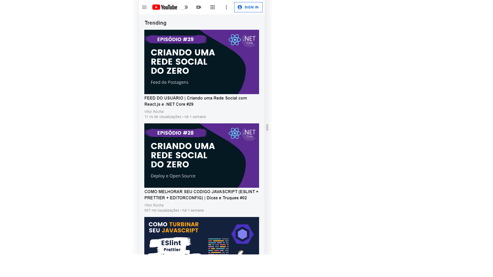

# Youtube-clone
A clone of the Youtube interface developed in react. 💻 

# NOT FINISHED

## :rocket: Technologies

This project was developed with the following technologies:

- [React JS](https://reactjs.org/)
- [Material UI](https://material-ui.com/)

### Available Scripts 💻

**Cloning repository and running**

```bash
$ git clone https://github.com/Vitorrrocha/youtube-clone && cd youtube-clone
```

**Installing dependencies**

```bash
$ yarn
```

**Getting Started**

```bash
$ yarn start
```
